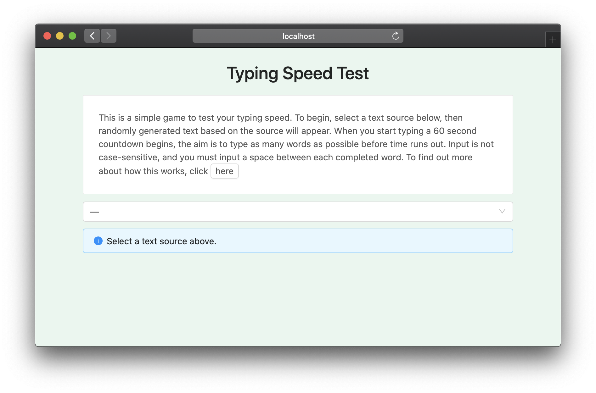

# Typing speed test

This is a simple game to test your typing speed. You select a text
source, then randomly generated text based on the source will
appear. When you start typing a 60 second countdown begins, the aim is to
type as many words as possible before time runs out.



## How is the text generated?

The text is generated using
[Markov chains](https://en.wikipedia.org/wiki/Markov_chain)
computed from the original source texts. Each source text is out of copyright
and freely available as a text file from
[Project Gutenberg](https://www.gutenberg.org/).
A Markov chain text generator works by taking an initial word, then
considering which word could follow it by referencing the source text, and
weighting the potential words by frequency. This process can be continued
infinitely.

The generated text rarely makes much sense, as the model only
considers the current word rather than any larger context.

## Which technologies are used?

I wrote a script which automatically generates the Markov models of
the source text using
[Haskell](https://www.haskell.org/).
These are all precomputed and stored as JSON files which the
application requests as required. This application is written using
Javascript with the
[React.js](https://reactjs.org/)
framework, as well as the
[Ant Design](https://ant.design/) UI
framework. The React project itself is fairly simple, and I used
[`create-react-app`](https://create-react-app.dev/)
to generate the build scripts and initial structure. Testing is done using the
[Jest](https://jestjs.io/) framework.

## Running locally

To run this project locally, simple clone this repository, navigate to it, then do:

```bash
yarn install    # or: npm install
yarn start      # or: npm run start

# to run the test suite:
yarn test       # or: npm test
```

> This requires you to have either [`yarn`](https://yarnpkg.com/en/) or [`npm`](https://www.npmjs.com/) installed.

The page should then open in your default web browser, running on
`localhost:3000`.

## Future work

- Allow user to select how long the test runs for
- Enable backspace to go back to previous words
